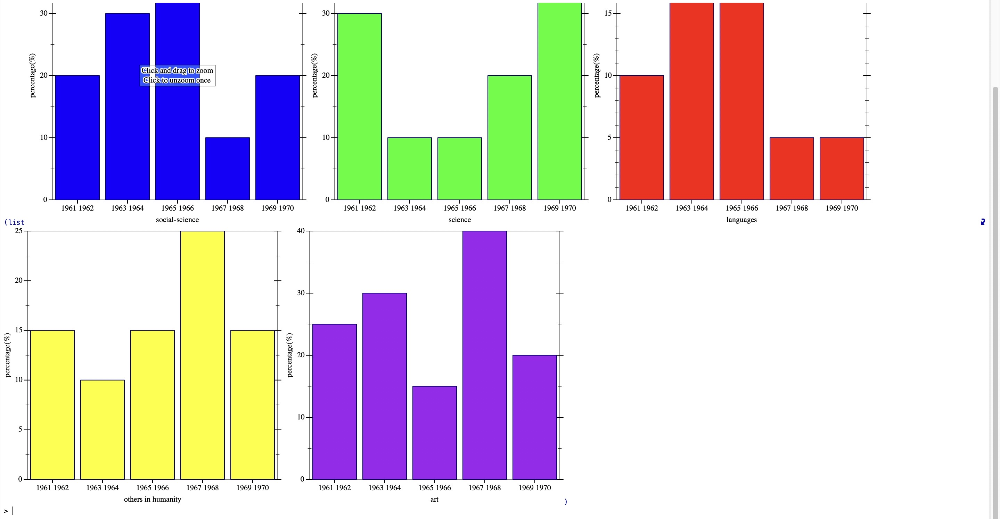

# Grinnell-Subjects-Popularity
We visualize the popularity of different subjects at Grinnell College during 1961 and 1970. This is the Final Project of CSC-151 at Grinnell College.

## Collaborators
* Altria Xu
* Huandong Chang
* Frank Li
* Ruixuan Li

## Project Description 
This project demonstrates a method of applying digital humanities to expedite the analysis of texts. Using the Scarlet and Black articles from the 60’s, the project compared the frequency that various academic subjects occur in articles across time periods. Analyzing this trend can help researchers determine the change in discussion of academic topics across time periods, as well as compare the frequency of discussion across topics. This project also had a focus on providing concise, well-designed visualization and analysis for the results of categorization using well-written, easily-adaptable code, which could then be used as a boilerplate or example for future research projects involving this kind of textual analysis and categorization.

## Visualization Example

